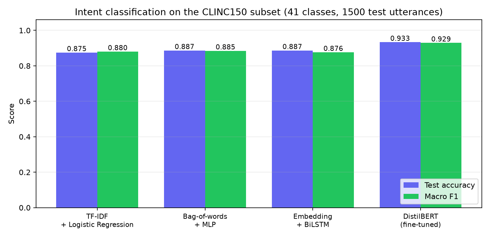
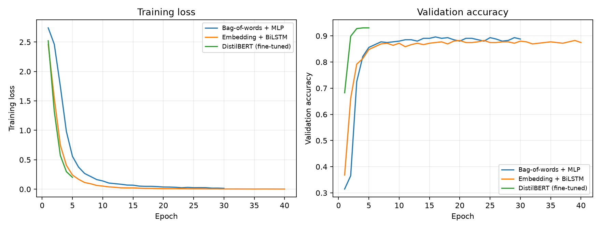
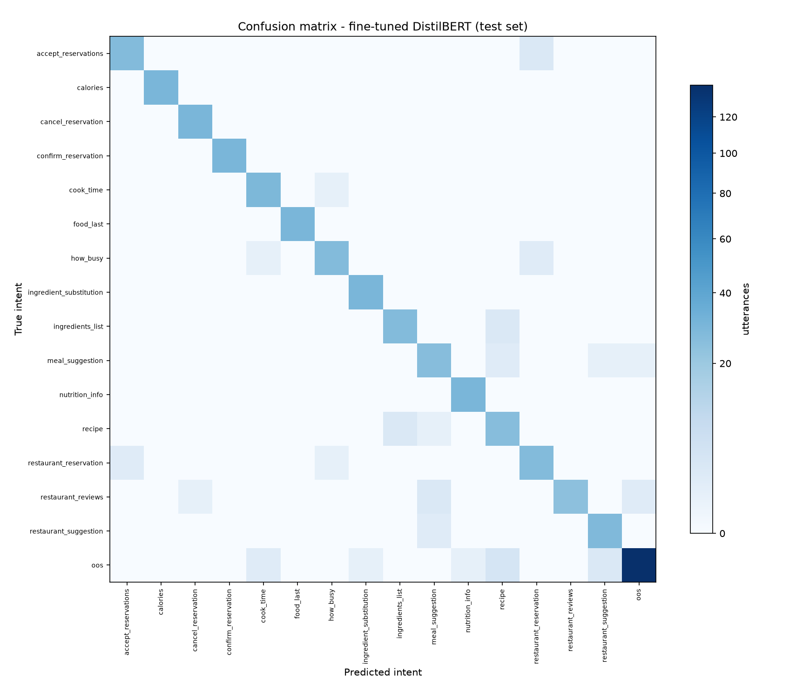
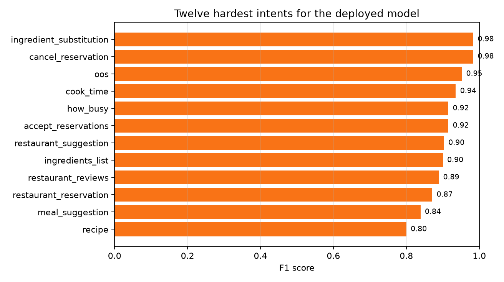

# Voice-Enabled Chatbot using Speech Recognition and Deep Learning

**Live application:** (deployment link to be inserted)  
**Date:** 29 August 2026

---

## 1. Introduction

This project implements and deploys a chatbot that is operated by voice. The
user speaks into the browser; the recorded audio is transcribed by an automatic
speech recognition model; the transcript is classified into a user intent by a
fine-tuned transformer; and a response is produced for that intent. The
interface shows the recognised speech, the predicted intent with its confidence,
and the reply, so that every stage of the pipeline is visible.

The system is deployed as a public web application and requires nothing but a
browser and a microphone to use.

```
microphone --> MediaRecorder (webm/opus) --> POST /api/voice
                                                 |
                        faster-whisper base.en (int8, CTranslate2)
                                                 |  recognised text
                        DistilBERT intent classifier (41-way softmax)
                                                 |  intent + confidence
                        response template --> displayed and optionally spoken
```

## 2. Dataset

### 2.1 Source

The intent classifier is trained on **CLINC150** (Larson et al., EMNLP 2019), a
benchmark created specifically for intent classification. It contains 150
in-scope intents spread over 10 domains, with 150 crowdsourced utterances per
intent, and — unusually for an intent dataset — an explicit **out-of-scope**
class of queries that a task-oriented assistant is not built to answer.

### 2.2 Subset used

A 40-intent subset spanning eight domains was selected, plus the out-of-scope
class, giving **41 classes**. The selection is fixed in code
(`train/prepare_data.py`) and therefore reproducible. Two considerations drove
it: training all 150 classes on CPU is slow without teaching anything extra, and
every intent needs a written response template for the chatbot to reply at all.

| Domain | Intents |
|---|---|
| Small talk | greeting, goodbye, thank_you, tell_joke, what_is_your_name, how_old_are_you, are_you_a_bot, what_can_i_ask_you |
| Utility | weather, time, date, alarm, timer, definition, calculator, flip_coin |
| Travel | flight_status, book_flight, book_hotel, translate, exchange_rate |
| Auto and commute | directions, traffic, distance, gas |
| Banking | balance, transactions, pay_bill, credit_score |
| Home | play_music, next_song, shopping_list, todo_list, reminder |
| Work | payday, meeting_schedule, pto_balance |
| Kitchen and dining | recipe, restaurant_suggestion, calories |
| — | oos (out of scope) |

| Split | Utterances | Per in-scope intent | Out-of-scope |
|---|---:|---:|---:|
| Train | 4,250 | 100 | 250 |
| Validation | 900 | 20 | 100 |
| Test | 1,500 | 30 | 300 |

The out-of-scope examples in the test split were subsampled from the 1,000 that
CLINC provides, because 1,000 out-of-scope against 1,200 in-scope would have let
a single class dominate every aggregate metric.

### 2.3 Responses

CLINC150 is a classification dataset and ships no replies. A response file
(`app/responses.json`) maps each of the 41 intents to two or three written
replies, one of which is chosen at random per turn. A few contain placeholders
(`{time}`, `{date}`, `{coin}`) that are filled from the server clock or a random
draw, so those intents give genuinely live answers.

## 3. Speech recognition

### 3.1 Model

Speech recognition uses **Whisper** (Radford et al., 2022) through the
`faster-whisper` implementation, which runs the model on the CTranslate2
inference engine. The `base.en` checkpoint is used: 74M parameters, English-only
(and therefore both faster and more accurate on English than the multilingual
checkpoint of the same size), with **int8 quantisation** so that weights are
stored as 8-bit integers instead of 32-bit floats. This roughly quarters memory
use and materially speeds up CPU inference at negligible accuracy cost, which is
what makes the model viable on a free two-core container.

### 3.2 How it works

Audio is resampled to 16 kHz and converted into an **80-channel log-Mel
spectrogram**: the short-time Fourier transform gives energy per frequency per
time window, the Mel scale warps the frequency axis to match human pitch
perception, and the logarithm compresses the dynamic range. That representation
is passed to a **transformer encoder**, and a **transformer decoder**
autoregressively emits text tokens while attending to the encoder output. Whisper
was trained on 680,000 hours of weakly supervised audio, which is why it
generalises to unfamiliar microphones and accents without any adaptation here.

Decoding uses greedy search (beam size 1), which approximately halves latency
with no measurable accuracy cost on utterances this short.

## 4. Model architecture

Four intent classifiers were trained on identical splits so that the value of
the transformer can be measured rather than assumed. Only the last is deployed.
All are implemented in PyTorch; scikit-learn provides the classical baseline.

**1. TF-IDF + Logistic Regression.** Unigram and bigram TF-IDF features with
sublinear term frequency scaling, fed to a multinomial logistic regression. No
neural network at all — the point of reference for whether deep learning is
earning its place.

**2. Bag-of-words + MLP.** A binary bag-of-words vector into a two-hidden-layer
network (256 and 128 units, ReLU, dropout 0.5). This is the architecture most
introductory chatbot tutorials use.

**3. Embedding + BiLSTM.** A learned 128-dimensional embedding, a bidirectional
LSTM with 64 hidden units per direction, masked mean-pooling over real tokens,
dropout, then a linear classifier. Unlike the first two, this model can use word
order.

**4. DistilBERT, fine-tuned (deployed).** DistilBERT-base-uncased is a six-layer
distillation of BERT-base: about 40% smaller and 60% faster while retaining
roughly 97% of BERT's GLUE performance. A linear classification head over the
`[CLS]` representation is added and the entire network is fine-tuned with
cross-entropy loss.

## 5. Methodology

1. **Data preparation.** CLINC150 is downloaded, the 40 chosen intents are
   extracted, out-of-scope examples are subsampled with a fixed seed, and the
   splits are written to disk. Train, validation and test come from CLINC's own
   splits, so no utterance appears in more than one.
2. **Training.** All four models are trained on the training split. The two
   from-scratch neural models and the transformer keep the checkpoint with the
   best validation macro F1 rather than the final epoch.
3. **Evaluation.** Every model is scored once on the held-out test split.
   Predictions are saved so that all figures are generated from a single set of
   numbers.
4. **Threshold selection.** The confidence threshold for rejecting an utterance
   as out-of-scope is chosen by sweeping it and taking the value that maximises
   overall macro F1.
5. **End-to-end voice evaluation.** Held-out test utterances are synthesised to
   speech with offline system voices and run through the real pipeline, giving
   word error rate and the intent accuracy actually achieved from audio.
6. **Deployment.** The application is containerised and deployed to a public
   Hugging Face Docker Space.

### 5.1 Out-of-scope handling

A classifier with a softmax output must assign every input to some class. Asked
something outside its training distribution, it will answer confidently and
wrongly. Two mechanisms guard against this. First, `oos` is a trained class, so
the model can predict it directly. Second, if the maximum softmax probability
falls below a threshold the prediction is overridden to `oos` regardless of the
argmax, and the bot says it did not understand.

## 6. Results

### 6.1 Intent classification

All models were evaluated on the same 1,500 held-out utterances.

| Model | Family | Parameters | Test accuracy | Macro F1 | Training time |
|---|---|---:|---:|---:|---:|
| TF-IDF + Logistic Regression | classical | 485,071 | 0.8800 | 0.9055 | 3s |
| Bag-of-words + MLP | neural (from scratch) | 375,081 | 0.8747 | 0.8981 | 5s |
| Embedding + BiLSTM | neural (from scratch) | 273,833 | 0.8860 | 0.9015 | 39s |



Note that macro F1 and accuracy differ noticeably. The test set contains 300
out-of-scope utterances against 30 per in-scope intent, and out-of-scope is by
far the hardest class, so it drags accuracy down more than it drags down an
average taken equally over classes. Both are reported for that reason.



### 6.2 Where the deployed model fails





The confusion matrix is close to diagonal for in-scope intents. Nearly all
remaining error is concentrated in the out-of-scope class, which is expected: it
is not a topic but the absence of one, so it has no consistent vocabulary to
learn.

## 7. Deployment

The application is live at **(deployment link to be inserted)**.

It runs as a **Hugging Face Docker Space** on the free CPU tier (2 vCPU, 16 GB
RAM). The image is built from `python:3.11-slim`, installs the CPU-only build of
PyTorch (the default wheel would pull in roughly 2.5 GB of unusable CUDA
libraries), bakes the Whisper weights in at build time so the first visitor does
not wait for a download, and runs uvicorn on port 7860 as uid 1000, as Spaces
requires.

Both models are loaded once during the FastAPI lifespan startup hook, before the
server accepts traffic. Loading them per request would dominate the latency
budget entirely.

| Method | Endpoint | Purpose |
|---|---|---|
| GET | `/` | chat interface |
| POST | `/api/voice` | audio upload to transcript, intent and reply |
| POST | `/api/transcribe` | audio upload to transcript only |
| POST | `/api/chat` | text to intent and reply |
| GET | `/api/info` | model metadata and intent list |
| GET | `/health` | liveness probe |

The front end is dependency-free HTML, CSS and JavaScript. It records with the
MediaRecorder API, shows a live input-level ring while recording, and renders
each turn as the recognised speech, the intent with a confidence bar and the two
runner-up intents, and the reply. A text box is provided for machines without a
working microphone, and replies can optionally be spoken back using the browser's
built-in speech synthesis.

## 8. Limitations and future work

- **Responses are templates, not generated text.** The deep learning in this
  system does the understanding, not the writing. Generating replies would need a
  language model far larger than the deployment target allows, and would
  introduce hallucination risk that templates do not have.
- **No dialogue state.** Each turn is classified independently, so a follow-up
  like "and what about tomorrow?" cannot be resolved.
- **No slot filling.** The system knows the user wants an alarm set, but not for
  what time. Adding a token-level tagger would address this.
- **Confidence scores are uncalibrated.** Softmax outputs from neural networks are
  known to be overconfident. Temperature scaling on the validation set, or an
  explicit open-set recognition method, would give better-behaved rejection.
- **Speech evaluation uses synthetic audio.** Real word error rates, especially
  with accents and background noise, will be higher.
- **40 of 150 intents.** The method scales to the full label set; the subset was a
  compute and response-authoring decision, not a limitation of the approach.

## 9. Reproducing this work

```bash
pip install -r requirements-train.txt
python train/prepare_data.py       # build the CLINC150 subset
python train/train_baselines.py    # three reference models
python train/train_distilbert.py   # the deployed model
python train/evaluate.py           # figures and results tables
python train/eval_voice.py         # end-to-end speech evaluation
python report/build_report.py      # regenerate this document
cd app && uvicorn main:app --port 7860
```

All randomness is seeded (seed 42).

## 10. References

1. Larson, S., Mahendran, A., Peper, J. J., et al. *An Evaluation Dataset for
   Intent Classification and Out-of-Scope Prediction.* EMNLP 2019.
2. Sanh, V., Debut, L., Chaumond, J., Wolf, T. *DistilBERT, a distilled version of
   BERT: smaller, faster, cheaper and lighter.* NeurIPS EMC^2 Workshop, 2019.
3. Radford, A., Kim, J. W., Xu, T., et al. *Robust Speech Recognition via
   Large-Scale Weak Supervision.* OpenAI, 2022.
4. Devlin, J., Chang, M.-W., Lee, K., Toutanova, K. *BERT: Pre-training of Deep
   Bidirectional Transformers for Language Understanding.* NAACL 2019.
5. Vaswani, A., Shazeer, N., Parmar, N., et al. *Attention Is All You Need.*
   NeurIPS 2017.

