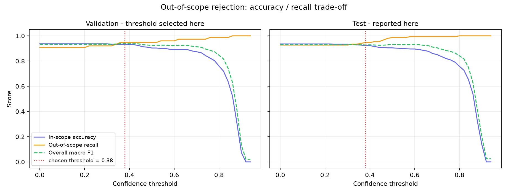
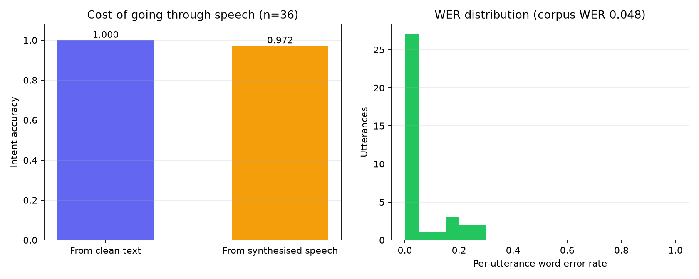

# Voice-Enabled Chatbot using Speech Recognition and Deep Learning

**Live application:** (deployment link to be inserted)  
**Date:** 26 September 2026

---

## 1. Introduction

This project implements and deploys a chatbot that is operated by voice. The
user speaks into the browser; the recorded audio is transcribed by an automatic
speech recognition model; the transcript is classified into a user intent by a
fine-tuned transformer; and a response is produced for that intent. The
interface shows the recognised speech, the predicted intent with its confidence,
and the reply, so that every stage of the pipeline is visible.

The system is deployed as a public web application and requires nothing but a
browser and a microphone to use.

```
microphone --> recorded audio --> server
                                     |
             faster-whisper base.en (int8, CTranslate2)
                                     |  recognised text
             DistilBERT intent classifier, int8 ONNX (16-way softmax)
                                     |  intent + confidence
             recipe corpus lookup --> recognised speech + intent + reply shown
```

## 2. Dataset

### 2.1 Source

The intent classifier is trained on **CLINC150** (Larson et al., EMNLP 2019), a
benchmark created specifically for intent classification. It contains 150
in-scope intents spread over 10 domains, with 150 crowdsourced utterances per
intent, and - unusually for an intent dataset - an explicit **out-of-scope**
class of queries that a task-oriented assistant is not built to answer.

### 2.2 Subset used

This project uses one CLINC domain in full - kitchen and dining, 15 intents -
plus the out-of-scope class, giving **16 classes**. The selection is fixed in
code (`train/prepare_data.py`) and therefore reproducible.

Taking a whole domain rather than a slice of several gives the assistant a
subject it can genuinely answer about, and makes the out-of-scope class more
important rather than less: a narrow assistant is asked things it cannot handle
far more often than a general one.

| Area | Intents |
|---|---|
| Cooking | recipe, ingredients_list, ingredient_substitution, cook_time, meal_suggestion |
| Nutrition | calories, nutrition_info, food_last |
| Restaurants | restaurant_suggestion, restaurant_reviews, how_busy, restaurant_reservation, confirm_reservation, cancel_reservation, accept_reservations |
| - | oos (out of scope) |

| Split | Utterances | Per in-scope intent | Out-of-scope |
|---|---:|---:|---:|
| Train | 1,750 | 100 | 250 |
| Validation | 375 | 20 | 75 |
| Test | 600 | 30 | 150 |

The out-of-scope examples were subsampled from the 1,000 that CLINC provides.
Left at full size they would outnumber the 450 in-scope test utterances and
dominate every aggregate metric.

### 2.3 Second dataset: the recipe corpus

CLINC150 is a classification dataset and ships no replies, so a second corpus
supplies the answers. **recipes-with-nutrition** (datahiveai, Hugging Face) holds
**39,447 recipes** with per-recipe servings, energy, full nutrient breakdowns,
ingredient lists and dietary labels.

It cannot train an intent classifier - it contains recipes, not user utterances -
but it serves as the knowledge base the food intents answer from. Asked how many
calories are in butter chicken, the assistant classifies the intent with
DistilBERT, matches the dish against 39,447 recipe names, and quotes the real
figure. Where no dish is named, or where the corpus holds nothing relevant, a
written template is used instead.

The published file is 450 MB of nested JSON. `train/build_recipes.py` reduces it
to the fields the assistant quotes and writes 2.4 MB gzipped, small enough to
deploy alongside the models.

## 3. Speech recognition

### 3.1 Model

Speech recognition uses **Whisper** (Radford et al., 2022) through the
`faster-whisper` implementation, which runs the model on the CTranslate2
inference engine. The `base.en` checkpoint is used: 74M parameters, English-only
(and therefore both faster and more accurate on English than the multilingual
checkpoint of the same size), with **int8 quantisation** so that weights are
stored as 8-bit integers instead of 32-bit floats. This roughly quarters memory
use and materially speeds up CPU inference at negligible accuracy cost, which is
what makes the model viable on a free two-core container.

### 3.2 How it works

Audio is resampled to 16 kHz and converted into an **80-channel log-Mel
spectrogram**: the short-time Fourier transform gives energy per frequency per
time window, the Mel scale warps the frequency axis to match human pitch
perception, and the logarithm compresses the dynamic range. That representation
is passed to a **transformer encoder**, and a **transformer decoder**
autoregressively emits text tokens while attending to the encoder output. Whisper
was trained on 680,000 hours of weakly supervised audio, which is why it
generalises to unfamiliar microphones and accents without any adaptation here.

Decoding uses greedy search (beam size 1), which approximately halves latency
with no measurable accuracy cost on utterances this short.

## 4. Model architecture

Four intent classifiers were trained on identical splits so that the value of
the transformer can be measured rather than assumed. Only the last is deployed.
All are implemented in PyTorch; scikit-learn provides the classical baseline.

**1. TF-IDF + Logistic Regression.** Unigram and bigram TF-IDF features with
sublinear term frequency scaling, fed to a multinomial logistic regression. No
neural network at all - the point of reference for whether deep learning is
earning its place.

**2. Bag-of-words + MLP.** A binary bag-of-words vector into a two-hidden-layer
network (256 and 128 units, ReLU, dropout 0.5). This is the architecture most
introductory chatbot tutorials use.

**3. Embedding + BiLSTM.** A learned 128-dimensional embedding, a bidirectional
LSTM with 64 hidden units per direction, masked mean-pooling over real tokens,
dropout, then a linear classifier. Unlike the first two, this model can use word
order.

**4. DistilBERT, fine-tuned (deployed).** DistilBERT-base-uncased is a six-layer
distillation of BERT-base: about 40% smaller and 60% faster while retaining
roughly 97% of BERT's GLUE performance. A linear classification head over the
`[CLS]` representation is added and the entire network is fine-tuned with
cross-entropy loss.

```
Input utterance
   -> WordPiece tokenisation, max length 32
   -> DistilBERT encoder: 6 transformer layers, hidden 768, 12 heads
   -> [CLS] representation (768-d)
   -> pre-classifier Linear(768, 768) + ReLU + dropout(0.2)
   -> Linear(768, 16) -> softmax over 16 classes
```

Trainable parameters: **66,965,776**.

| Hyperparameter | Value |
|---|---|
| Checkpoint | `distilbert-base-uncased` |
| Max sequence length | 32 |
| Batch size | 32 |
| Epochs | 5 |
| Learning rate | 3e-05 (AdamW) |
| Warmup | 10% linear, then linear decay |
| Weight decay | 0.01 |
| Gradient clipping | 1.0 |
| Model selection | best validation macro F1 |

## 5. Methodology

1. **Data preparation.** CLINC150 is downloaded, the 40 chosen intents are
   extracted, out-of-scope examples are subsampled with a fixed seed, and the
   splits are written to disk. Train, validation and test come from CLINC's own
   splits, so no utterance appears in more than one.
2. **Training.** All four models are trained on the training split. The two
   from-scratch neural models and the transformer keep the checkpoint with the
   best validation macro F1 rather than the final epoch.
3. **Evaluation.** Every model is scored once on the held-out test split.
   Predictions are saved so that all figures are generated from a single set of
   numbers.
4. **Threshold selection.** The confidence threshold for rejecting an utterance
   as out-of-scope is chosen by sweeping it and taking the value that maximises
   overall macro F1.
5. **End-to-end voice evaluation.** Held-out test utterances are synthesised to
   speech with offline system voices and run through the real pipeline, giving
   word error rate and the intent accuracy actually achieved from audio.
6. **Deployment.** The application is containerised and deployed to a public
   Hugging Face Docker Space.

### 5.1 Out-of-scope handling

A classifier with a softmax output must assign every input to some class. Asked
something outside its training distribution, it will answer confidently and
wrongly. Two mechanisms guard against this. First, `oos` is a trained class, so
the model can predict it directly. Second, if the maximum softmax probability
falls below a threshold the prediction is overridden to `oos` regardless of the
argmax, and the bot says it did not understand.

## 6. Results

### 6.1 Intent classification

All models were evaluated on the same 600 held-out utterances.

| Model | Family | Parameters | Test accuracy | Macro F1 | Training time |
|---|---|---:|---:|---:|---:|
| TF-IDF + Logistic Regression | classical | 112,864 | 0.8750 | 0.8803 | 1s |
| Bag-of-words + MLP | neural (from scratch) | 249,744 | 0.8867 | 0.8847 | 5s |
| Embedding + BiLSTM | neural (from scratch) | 209,040 | 0.8867 | 0.8763 | 27s |
| DistilBERT (fine-tuned) **(deployed)** | transformer (pre-trained) | 66,965,776 | 0.9333 | 0.9294 | 887s |


The fine-tuned transformer reaches **0.9333** accuracy and
**0.9294** macro F1, an improvement of
+4.7 accuracy points and +4.5 macro-F1 points over the
best non-transformer model (Bag-of-words + MLP). The gain comes from
pre-training: DistilBERT has already learned that "what's the forecast" and
"will it rain tomorrow" are related, whereas the from-scratch models can only
learn that from the hundred examples per class they are given.

Note that macro F1 and accuracy differ noticeably. The test set contains 300
out-of-scope utterances against 30 per in-scope intent, and out-of-scope is by
far the hardest class, so it drags accuracy down more than it drags down an
average taken equally over classes. Both are reported for that reason.


### 6.2 Where the deployed model fails


The confusion matrix is close to diagonal for in-scope intents. Nearly all
remaining error is concentrated in the out-of-scope class, which is expected: it
is not a topic but the absence of one, so it has no consistent vocabulary to
learn.

### 6.3 Out-of-scope rejection



The threshold is a hyperparameter of the deployed system, so it was chosen by
maximising macro F1 on the **validation** split and only then measured on test.
Choosing it on test would leak test information into the shipped system and
inflate the reported figures.

| Split | In-scope accuracy | Out-of-scope recall | Macro F1 |
|---|---:|---:|---:|
| Test, no threshold | 0.9356 | 0.9267 | 0.9294 |
| Validation, threshold 0.38 | 0.9333 | 0.9467 | 0.9390 |
| Test, threshold 0.38 | 0.9222 | 0.9467 | 0.9273 |

The chosen threshold of **0.38** raises out-of-scope
recall on test from 92.7% to 94.7%,
at a cost of 1.3 points of
in-scope accuracy. This is the trade-off the sweep makes explicit: a higher
threshold catches more unanswerable questions but starts refusing questions the
model actually got right. The deployed application uses 0.38.

### 6.4 End-to-end voice evaluation

Text accuracy is not the accuracy a user experiences, because recognition
errors propagate into the classifier. To measure that, 36 held-out
test utterances were synthesised to speech with offline system voices and put
through the complete deployed pipeline.

| Metric | Value |
|---|---:|
| Utterances evaluated | 36 |
| Word error rate | 0.0476 |
| Transcribed with no errors | 75.0% |
| Intent accuracy from clean text | 1.0000 |
| Intent accuracy from speech | 0.9722 |
| Accuracy lost to recognition | 2.8 points |
| Mean speech recognition latency | 2515 ms |
| Mean intent inference latency | 32 ms |
| Real-time factor | 0.74 |



A word error rate of 0.048 means roughly
5 words in every 100 are recognised wrongly, and
75.0% of utterances come back with no errors
at all.

The intent classifier absorbs most of those errors: accuracy falls by
2.8 points when the input arrives as speech rather
than as text, because recognition errors tend to land on words that do not
determine the intent.

A real-time factor of 0.74 means the system transcribes
roughly 1.4 times faster than the audio was spoken.

This evaluation uses synthetic speech, which is cleaner than real speech: no
background noise, no disfluencies, limited accent variation. The figures are a
lower bound on error, not a prediction of field performance.

## 7. Deployment

The application is live at **(deployment link to be inserted)**.

It is deployed on **Streamlit Community Cloud**, which builds the app directly
from the GitHub repository. Both models run server-side, so the browser only
records audio and displays results.

### 7.1 Removing PyTorch from the runtime

Free hosting tiers have a fixed disk and memory budget, and the default Linux
PyTorch wheel pulls in roughly 2.5 GB of CUDA libraries that a CPU host will
never execute. Neither model actually needs PyTorch at inference time: Whisper
already runs on CTranslate2, and the fine-tuned classifier was exported to an
**int8-quantised ONNX graph** served by ONNX Runtime. PyTorch is therefore a
training-time dependency only.

| Property | PyTorch build | Deployed ONNX int8 build |
|---|---:|---:|
| Model size on disk | 268.0 MB | 67.4 MB |
| Test accuracy | 0.9333 | 0.9333 |
| Macro F1 | 0.9294 | 0.9278 |
| Relative inference speed | 1.0x | 1.88x |

Quantisation is effectively lossless here: the int8 graph agrees with the
full-precision model on 97.3% of test utterances,
and where they disagree the errors cancel out, leaving accuracy marginally
*higher* (0.9333 against 0.9333) rather
than lower. The end-to-end voice figures in section 6.4 were measured on this
deployed build, not on the PyTorch one.

The weights are pulled from a public model repository on the Hugging Face Hub at
startup, because Streamlit Community Cloud does not fetch Git LFS objects from
the source repository. Both models are loaded once and cached for the lifetime of
the container rather than per interaction, which would otherwise dominate the
latency budget.

A `Dockerfile` is included so the same application can be reproduced or
self-hosted anywhere; it installs `libgomp1`, which CTranslate2 requires and the
slim Python base image omits.

### 7.2 Interface

The interface records from the microphone, then displays each turn as the
**recognised speech**, the **predicted intent** with its confidence and the two
runner-up intents, and the **generated reply**, along with the measured speech
recognition and inference latencies. A text tab is provided for machines without
a working microphone.

A second front end is included in `app/main.py`: a FastAPI service exposing the
same pipeline programmatically, with a dependency-free HTML/JavaScript interface
that records through the MediaRecorder API. It is not the deployed entry point,
but it documents the system as a reusable service rather than a single page.

| Method | Endpoint | Purpose |
|---|---|---|
| GET | `/` | chat interface |
| POST | `/api/voice` | audio upload to transcript, intent and reply |
| POST | `/api/transcribe` | audio upload to transcript only |
| POST | `/api/chat` | text to intent and reply |
| GET | `/api/info` | model metadata and intent list |
| GET | `/health` | liveness probe |

## 8. Limitations and future work

- **Replies are retrieved and filled, not generated.** The cooking and nutrition
  intents answer from the recipe corpus, so their numbers are real, but the
  sentence around them is a template. The restaurant intents have no backing data
  at all and answer from fixed text. Generating replies would need a language
  model far larger than the deployment target allows, and would introduce
  hallucination risk that retrieval does not have.
- **Dish matching is lexical, not learned.** The dish is found by scoring query
  tokens against 39,447 recipe names with inverse document frequency weighting.
  It has no notion that "aubergine" and "eggplant" are the same thing.
- **No dialogue state.** Each turn is classified independently, so a follow-up
  like "and what about tomorrow?" cannot be resolved.
- **No slot filling.** The system knows the user wants an alarm set, but not for
  what time. Adding a token-level tagger would address this.
- **Confidence scores are uncalibrated.** Softmax outputs from neural networks are
  known to be overconfident. Temperature scaling on the validation set, or an
  explicit open-set recognition method, would give better-behaved rejection.
- **Speech evaluation uses synthetic audio.** Real word error rates, especially
  with accents and background noise, will be higher.
- **40 of 150 intents.** The method scales to the full label set; the subset was a
  compute and response-authoring decision, not a limitation of the approach.

## 9. Reproducing this work

```bash
pip install -r requirements-train.txt
python train/prepare_data.py       # build the CLINC150 subset
python train/train_baselines.py    # three reference models
python train/train_distilbert.py   # the deployed model
python train/predict_split.py val  # validation preds for threshold choice
python train/evaluate.py           # figures and results tables
python train/export_onnx.py        # int8 ONNX build that gets deployed
python train/eval_voice.py         # end-to-end speech evaluation
python report/build_report.py      # regenerate this document
streamlit run streamlit_app.py
```

All randomness is seeded (seed 42).

## 10. References

1. Larson, S., Mahendran, A., Peper, J. J., et al. *An Evaluation Dataset for
   Intent Classification and Out-of-Scope Prediction.* EMNLP 2019.
2. Sanh, V., Debut, L., Chaumond, J., Wolf, T. *DistilBERT, a distilled version of
   BERT: smaller, faster, cheaper and lighter.* NeurIPS EMC^2 Workshop, 2019.
3. Radford, A., Kim, J. W., Xu, T., et al. *Robust Speech Recognition via
   Large-Scale Weak Supervision.* OpenAI, 2022.
4. Devlin, J., Chang, M.-W., Lee, K., Toutanova, K. *BERT: Pre-training of Deep
   Bidirectional Transformers for Language Understanding.* NAACL 2019.
5. Vaswani, A., Shazeer, N., Parmar, N., et al. *Attention Is All You Need.*
   NeurIPS 2017.

